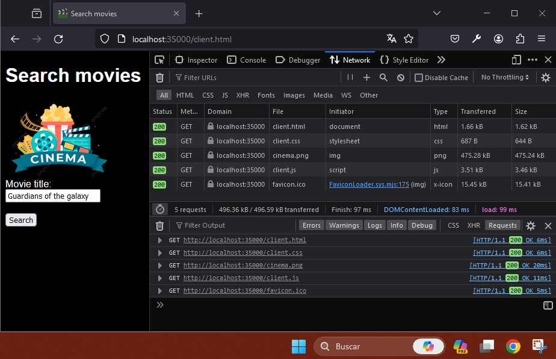
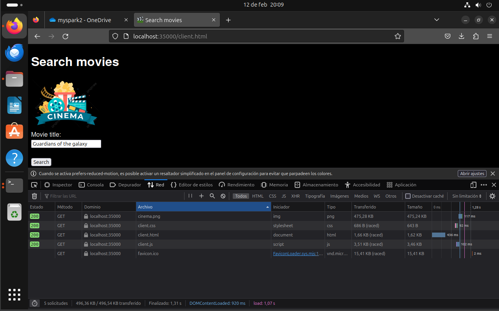
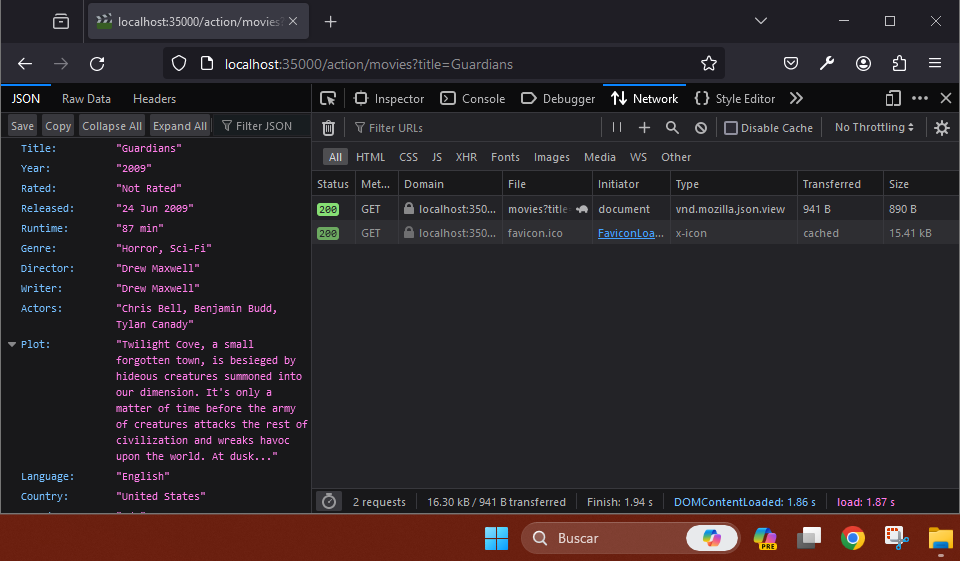
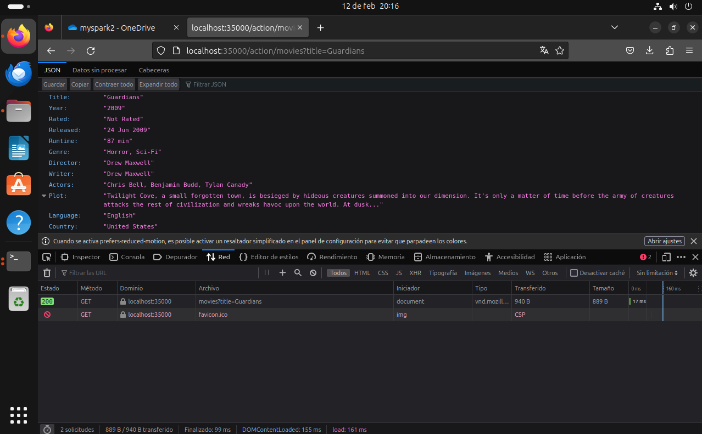
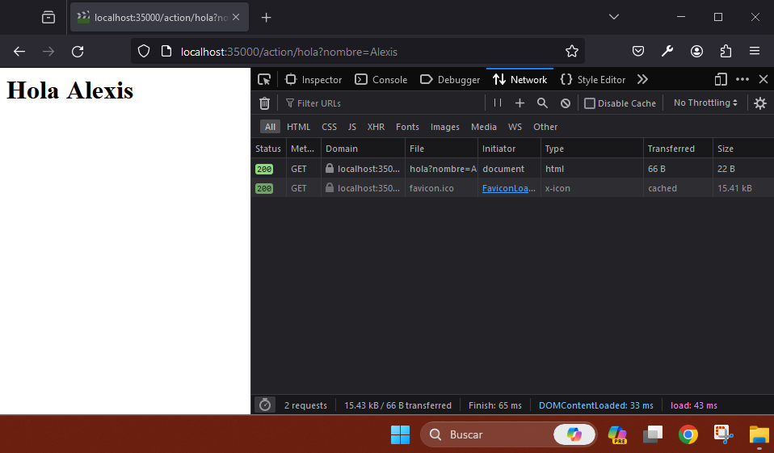
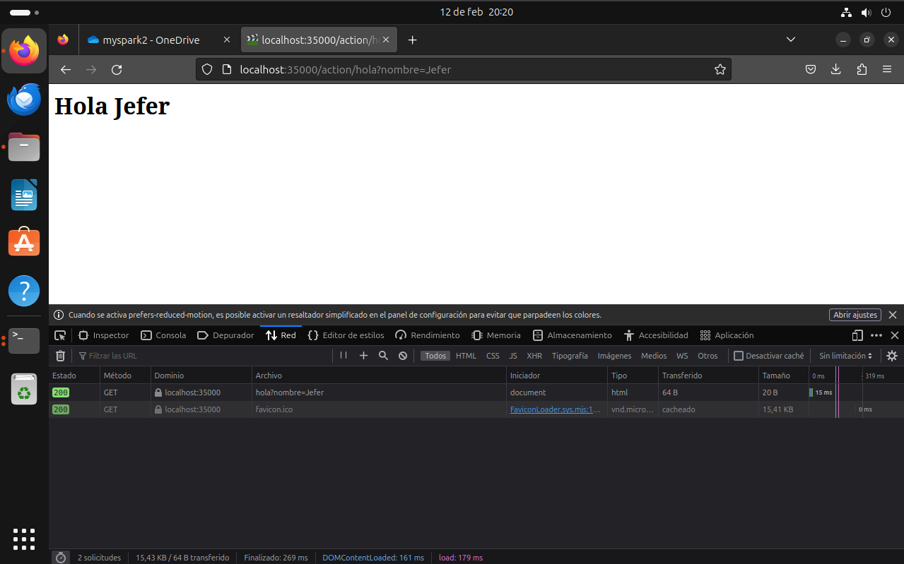
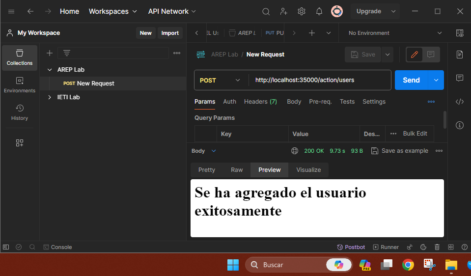
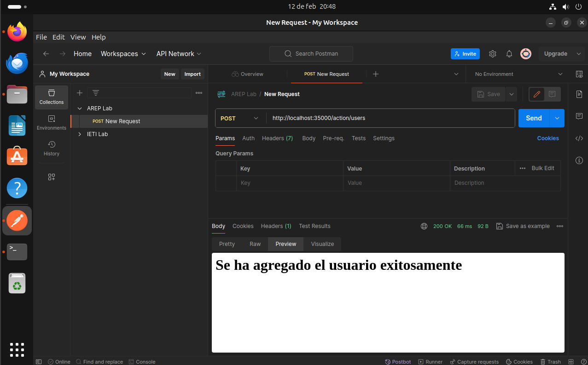

# TALLER 3: MICROFRAMEWORKS WEB

Servidor web que soportar una funcionalidad similar a la de Spark. La aplicación permite el registro de servicios get y post usando funciones lambda. Además, implementa funciones que le permiten configurar el directorio de los archivos estáticos, y otra que permite cambiar el tipo de la respuesta a "application/json".

## Comenzando

Estas instrucciones te ayudarán a obtener una copia del proyecto en funcionamiento en tu máquina local para fines de desarrollo y pruebas.

### Requisitos previos

- Kit de desarrollo de Java (JDK) versión 11 o posterior
- Herramienta de construcción Maven

### Instalando

1. Clona el repositorio:
    ```
    git clone https://github.com/AlexisGR117/AREP-TALLER3.git
    ```
2. Navega a la carpeta del proyecto:
    ```
    cd AREP-TALLER23
    ```
3. Construye el proyecto usando Maven:
    ```
    mvn clean install
    ```
4.  Ejecuta la aplicación:
    ```
    java -cp target/AREP-TALLER3-1.0-SNAPSHOT.jar edu.eci.arep.MyWebServices
    ```
5. Abre un navegador web y accede a la aplicación en http://localhost:35000/client.html.
## Ejecutando las pruebas

Ejecuta las pruebas unitarias:
```
mvn test
```

## Documentación

Para generar el Javadoc (se generará en la carpeta target/site):
```
mvn site
```

## Arquitectura

El proyecto implementa un servidor web simple usando Java que soporta solicitudes GET y POST. Utiliza servicios web definidos por la interfaz WebService y funciones lambda para manejar rutas específicas. A continuación se presentan los componentes clave:

### Clases:

#### MovieInfoServer:

- Instancia singleton que administra los servicios web y la funcionalidad del servidor.
- Registra servicios web GET y POST utilizando los métodos get y post.
- Inicia el servidor y escucha las solicitudes del cliente en el puerto 35000.
- Maneja las solicitudes del cliente enrutándolas a los servicios web apropiados según la ruta y el método HTTP.
- Proporciona métodos para configurar el directorio estático y el tipo de contenido de la respuesta.

#### MyWebServices:

- Punto de entrada principal para la aplicación.
- Registra servicios web de ejemplo para películas y un mensaje de saludo.
- Establece el directorio estático para servir archivos estáticos.
- Inicia el MovieInfoServer.
#### OMDbMovieDataProvider:

- Implementa la interfaz MovieDataProvider.
- Obtiene información de películas de la API de OMDb usando el título dado.
- Usa la solicitud HTTP GET para recuperar datos.

#### MovieDataProvider:

- Interfaz que define el método para obtener datos de películas.

#### WebService:

- Interfaz que define el método handle que los servicios web implementan para procesar solicitudes.

### Características clave:

- Soporta solicitudes GET y POST.
- Usa funciones lambda para implementaciones de servicios web.
- Puede dar archivos estáticos desde un directorio especificado.
- Permite configurar el tipo de contenido de la respuesta.
- Usa la API de OMDb para obtener información de películas.

## Ejemplo de desarrollo

1. Para **registrar un servicio web** que maneja peticiones GET o POST se debe usar el método get/post de MovieInfoServer, este recibirá como primer parámetro la ruta del servicio web y cómo segundo la función lambda que define como se debe manejar la petición, esta función recibe como único parámetro un mapa que contiene los parámetros de la url.
    
    En el siguiente ejemplo se muestra cómo se podría registrar un servicio web, en este caso la ruta será "/hola" y la función lambda retornará una cadena que contiene el código HTML para una página que dice "Hola" seguido del valor del parámetro nombre obtenido del mapa p.
   
    Se debe tener en cuenta que se debe establecer el tipo de contenido de la respuesta con el método responseType de MovieInfoServer, en este caso se usa text/html para indicar que el servidor enviará una página HTML.

    ```java
    MovieInfoServer.get("/hola", p -> {
    MovieInfoServer.responseType("text/html");
        return "<h1>Hola " + p.get("nombre") + "</h1>";
    });
    ```

2. Si se desea **cambiar el tipo de la respuesta a "application/json"** se debe usar el método responseType de MovieInfoServer, el cual establecerá el tipo de respuesta del servidor web, en este caso se pasa como argumento application/json, esto significa que cualquier respuesta que se envíe desde el servidor después de esta línea será en formato JSON. 

   ```java
   MovieInfoServer.responseType("application/json");
   ```

3. En caso de que se quiera **configurar el directorio de los archivos estáticos** se debe usar el método staticDirectorý de MovieInfoServer, este recibe como parámetro el directorio que será la fuente de archivos estáticos para el servidor web, en el ejemplo se indica que el directorio será public/files-copy, esto significa que cualquier archivo que se encuentre dentro de este directorio se podrá acceder a través de la URL del servidor.

   ```java
   MovieInfoServer.staticDirectory("public/files-copy");
   ```
4. Para **iniciar el servidor** se debe obtener la instancia de MovieInfoServer con el método getInstace y seguido a este llamar su método runServer, como se muestra a continuación.

   ```java
   MovieInfoServer.getInstance().runServer();
   ```

## Evaluación

### Caso de prueba 1:

**Objetivo:** Verificar que el servidor entrega correctamente archivos.

**Entrada:** Solicitud al servidor para un archivo (client.hml).

**Salida:** El cliente debe mostrar los archivos correctamente, sin errores de carga o visualización.

#### Windows



#### Linux



Se realizó la petición a http://localhost:35000/client.html la cual obtuvo como respuesta exitosa tanto en Windows como en Linux el archivo html, que a su vez hace la petición a los demás archivos que se requieren para mostrar la aplicación.

### Caso de prueba 2:

**Objetivo:** Validar que el servicio web GET para "/action/movies" funciona correctamente.

**Entrada:** Solicitud GET a la ruta "/action/movies" con un parámetro de consulta "title" que especifica el título de una película.

**Salida:** El servidor debe responder con un JSON que contiene la información de la película.

#### Windows



#### Linux



Se realizó la petición GET a http://localhost:35000/action/movies?title=Guardians la cual obtuvo como respuesta exitosa el json con la información de la película que se pasó como parámetro.

### Caso de prueba 3:

**Objetivo:** Confirmar que el servicio web GET para "/action/hola" funciona correctamente.

**Entrada:** Solicitud GET a la ruta "/action/hola" con un parámetro de consulta "nombre".

**Salida:** El servidor debe responder con una página HTML que dice "Hola" seguido del nombre especificado en el parámetro.

#### Windows



#### Linux



Se realizó la petición GET a http://localhost:35000/action/hola?nombre=Alexis la cual obtuvo como respuesta exitosa el archivo html donde se muestra el parámetro que se recibió en la url.

### Caso de prueba 4:

**Objetivo:** Validar que el servicio web POST para "/action/users" funciona correctamente.

**Entrada:** Solicitud POST a la ruta "/action/users" con un cuerpo que contiene la información de un nuevo usuario.

**Salida:** El servidor debe responder con una página HTML que indica que el usuario se ha agregado exitosamente.

#### Windows



#### Linux



Se realizó la petición POST a http://localhost:35000/action/users la cual obtuvo como respuesta exitosa un archivo html.

## Construido con

- Java 11
- Maven

## Autores

* Jefer Alexis Gonzalez Romero